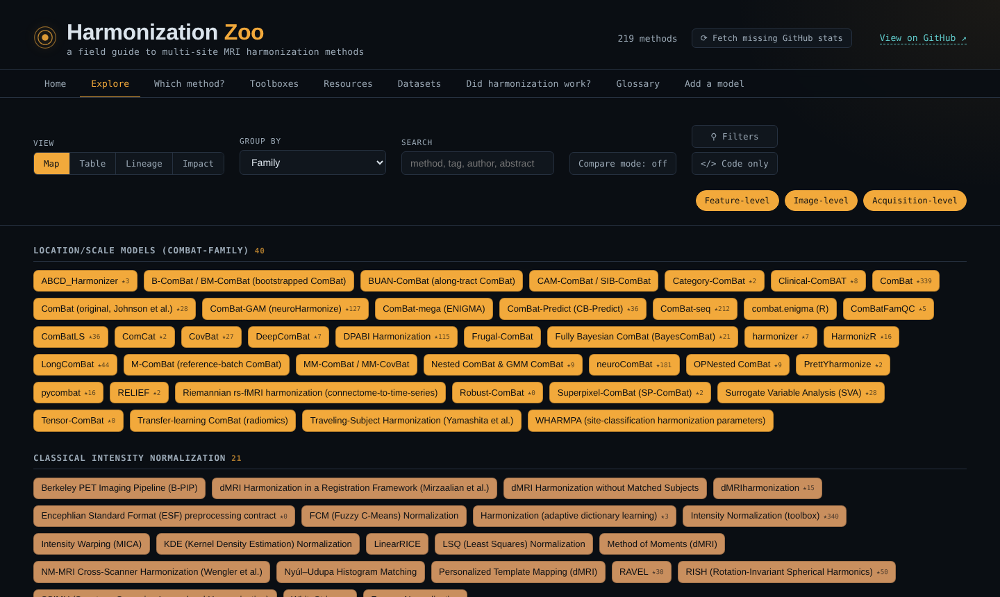
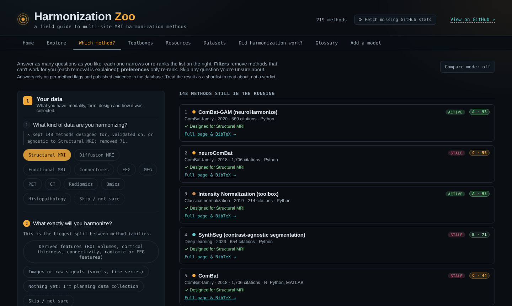
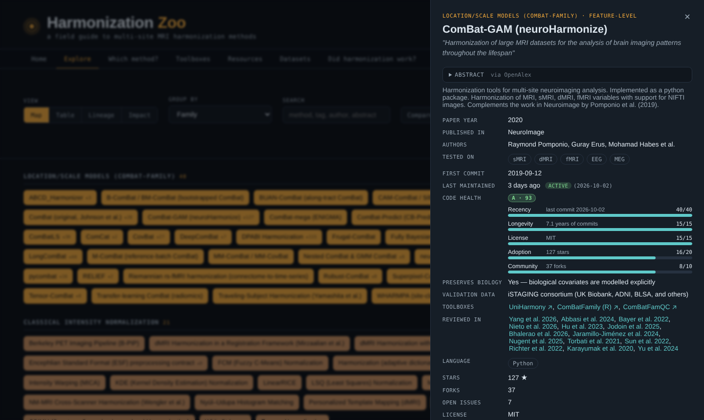

<div align="center">

# Harmonization Zoo

**A field guide to multi-site harmonization methods for neuroimaging and beyond.**

Find, compare and choose methods that remove scanner and site effects — from ComBat and its relatives
to deep-learning image translation, normative models, domain adaptation and EEG/MEG alignment.

[**Open the Zoo →**](https://n-nieto.github.io/HarmonizationZoo/)




</div>

## Why

Pooling data from several scanners or sites gives you statistical power, but it also adds
non-biological variability that can swamp — or fake — the effects you care about. Dozens of
harmonization methods exist, spread over papers, repositories and toolboxes, with very different
assumptions: some need traveling subjects, some need the site label, some can't be applied to a
new site, and some quietly leak the prediction target into a machine-learning pipeline.

The Zoo puts them in one place, with the information you need to pick one.

## What you'll find

| | |
|---|---|
| 🗺️ **Explore** | Every method as a map, table, family tree (lineage) or impact plot. Filter by modality, family, language, code availability, maintenance, code health and whether biology is explicitly preserved. Compare methods side by side. |
| 🧭 **Which method?** | Answer a few questions about your data and constraints; the list narrows live and explains every method it removes. |
| 📦 **Toolboxes** | Packages that bundle several methods (UniHarmony, ComBatFamily, NeuroHarm-kit, pyRiemann, …) and what each implements. |
| 📚 **Resources** | Reviews, comparison studies and best-practice papers, each linked to the methods it discusses. Search by author, keyword or year, export as CSV — plus notes on EEG/MEG harmonization. |
| 🧪 **Datasets** | Traveling-subject resources, benchmarks, phantoms and large multisite cohorts to develop and test methods on. |
| ✅ **Did harmonization work?** | A step-by-step checklist: site effects removed, biology kept, paired-data checks, leakage-safe evaluation. |
| 📖 **Glossary** | Batch effect, empirical Bayes, traveling subjects, confound removal… in plain language. |
| ➕ **Add a model** | A short form that turns into a GitHub pull request — no git needed. |

Every method also has its own page (`methods/<id>/`) with the abstract, paper details, code-health
score, install/usage snippets where available, lineage and a ready-to-copy BibTeX entry.

<p align="center">
  
  
</p>

## Contributing

The Zoo is a community reference — corrections and new methods are very welcome.

- **Missing a method?** Use the [Add a model](https://n-nieto.github.io/HarmonizationZoo/#add) tab, or edit
  [`data/methods.json`](data/methods.json) directly and open a pull request.
- **Spotted an error?** Every method page has a "Report an error" button that opens a pre-filled issue.
- **Know a good review, benchmark or dataset?** Add it to [`data/resources.json`](data/resources.json) or
  [`data/datasets.json`](data/datasets.json).

The field reference is in [`CONTRIBUTING.md`](CONTRIBUTING.md); how the data pipeline and automation work
is in [`MAINTAINERS.md`](MAINTAINERS.md).

## Run it locally

It's a static site — no build step, no backend.

```bash
git clone https://github.com/N-Nieto/HarmonizationZoo.git
cd HarmonizationZoo
python3 -m http.server 8000   # then open http://localhost:8000
```

## Citing

If the Zoo helps your work, please cite the original papers of the methods you use (each method page
has a BibTeX entry) and link to the Zoo.

## License

Code and curated data: MIT — see [`LICENSE`](LICENSE). Paper abstracts are shown for reference with
their source (OpenAlex, Europe PMC, publisher pages or arXiv); their copyright stays with the authors
and publishers.
